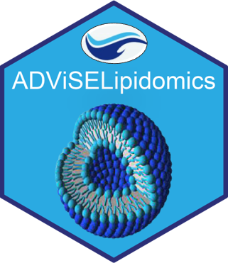

<!-- README.md is generated from README.Rmd. Please edit that file -->

```{r, include = FALSE}
knitr::opts_chunk$set(
  collapse = TRUE,
  comment = "#>",
  fig.path = "man/figures/README-",
  out.width = "100%"
)
```

# ADViSELipidomics 

<!-- badges: start -->
[](https://www.tidyverse.org/lifecycle/#stable)
[](https://github.com/ShinyFabio/ADViSELipidomics/actions)
<!-- badges: end -->


ADViSELipidomics is a novel Shiny app for the preprocessing, analysis, and visualization of lipidomics data. It copes with the outputs from LipidSearch and LIQUID for lipid identification and quantification, and with data available from the Metabolomics Workbench. ADViSELipidomics extracts information by parsing lipid species (using LIPID MAPS classification) and, together with information available on the samples, allows performing several exploratory and statistical analyses. In the presence of internal lipid standards in the experiment, ADViSELipidomics can normalize the data matrix, providing absolute values of concentration per lipid and sample. Moreover, it allows the identification of differentially abundant lipids in simple and complex experimental designs, dealing with batch effect correction.

## Installation
ADViSELipidomics is a stand-alone application implemented using the R language (R > 4.0) and the Shiny libraries. It can be installed as any other R package on several operating systems (Windows, macOS and Linux). Before installing the package you have to perform few supplementary steps based on your operating systems:

* **Windows (tested on Windows 10 64bit)**\ 

Before installing the package you need also to install Rtools from the following link:

https://cran.r-project.org/bin/windows/Rtools.

* **MacOS**\
If you are on MacOs run the following codes in the console:

``` r
brew install imagemagick@6
brew install cairo
```

* **Ubuntu (tested on 18.04).**\

If you are on Ubuntu run the following codes in the console:
```
sudo apt install build-essential libcurl4-gnutls-dev libxml2-dev libssl-dev
sudo apt-get install libcairo2-dev
sudo apt-get install libxt-dev
sudo apt install libmagick++-dev
sudo apt-get install libc6
sudo apt-get install libnlopt-dev

```

After that, open RStudio, check if you have already installed the ```{devtools}``` package and run the following code:

``` r
devtools::install_github("ShinyFabio/ADViSELipidomics")
```
We kindly suggest updating all the R packages requested during the installation process of ADViSELipidomics Shiny application. Be careful that if you need to install many packages and you decide to use compilation, the process could take a lot depending on your hardware and operating system.


## Usage
Once the installation is completed, run:

``` r
library("ADViSELipidomics")
run_ADViSELipidomics()
```

Depending on the screen size and especially the resolution of your monitor, ADViSELipidomics interface can be a bit different from how it was thought and built. Try to reduce or increment the zoom using **Ctrl** + **+** (plus) or **Ctrl** + **-** (minus) for Windows or Linux users, or **Command** + **+** (plus) or **Command** + **-** (minus) for Mac users.

An **user manual** is available at the following link: https://shinyfabio.github.io/ADViSELipidomics_book/


## Update
When a new ADViSELipidomics version is released, it can be updated with the same code for the installation.


## Data Availability
The software is intended as a tool for analyzing lipidomic data, nevertheless is it possible to test it with two different case studies as described in the supplementary to our paper [Supplementary](https://oup.silverchair-cdn.com/oup/backfile/Content_public/Journal/bioinformatics/PAP/10.1093_bioinformatics_btac706/1/btac706_supplementary_data.docx?Expires=1670405997&Signature=EPy4KG1w03cnGUWoa8jsEHbFRiyhKHX9Wf56yylPM2baQYjwB9oA0HoR3WUIPpWNBv2zfPRGrVm7b3Nj5aAacJ7qLmUSd9su20P4cmDuCiJbYx8ddv4P7cDzIIyeAMqmBEMscOBzWsGhB~Ql~Y8LjLXzxOlsjML8KaciMcFtZztK3Psf3wCnCxlKg9iZZ4mab0hZdA8rn048xbTk6534syqjx4KfAm2lcrDbnEC29dSmcfNyAj22CACWfOrhHHeHueNKbSu6hZeyIukQOdGKzGhTiG2D4VO4ZqH9dQ3JX-G~kAczQhQGwic-vm8hK-YcOIQrxgxnlWTaur~PV2mSww__&Key-Pair-Id=APKAIE5G5CRDK6RD3PGA).

If you want to test the software with a LipidSearch output, here we provide the files used in the Case Study 1. Before use, please extract the files from the archive.
<p>
  
<a href="https://github.com/ShinyFabio/ADViSELipidomics_book/raw/main/data_example/Case_Study_1.zip/">Case_Study_1.zip</a>
</p>

It is also possible to test it with a Metabolomics Workbench lipidomic experiment. ADViSELipidomics can download in real-time suitable selected lipidomic experiments from the online repository using the ```do_query()``` function from the ```{metabolomicsWorkbenchR}``` package. Internet connection is required.


## Citation
If you use ADViSELipidomics in your publications, we appreciate if you can cite us:

*E. Del Prete et al. (2022) ADViSELipidomics: a workflow for analyzing lipidomics data. Bioinformatics, 2022, 1–3*


## Funding
This work was supported by the project “Antitumor Drugs and Vaccines from the Sea (ADViSE)” project (CUP B43D18000240007–SURF 17061BP000000011) funded by POR Campania FESR 2014-2020 “Technology Platform for Therapeutic Strategies against Cancer” - Action 1.2.1 and 1.2.2.
